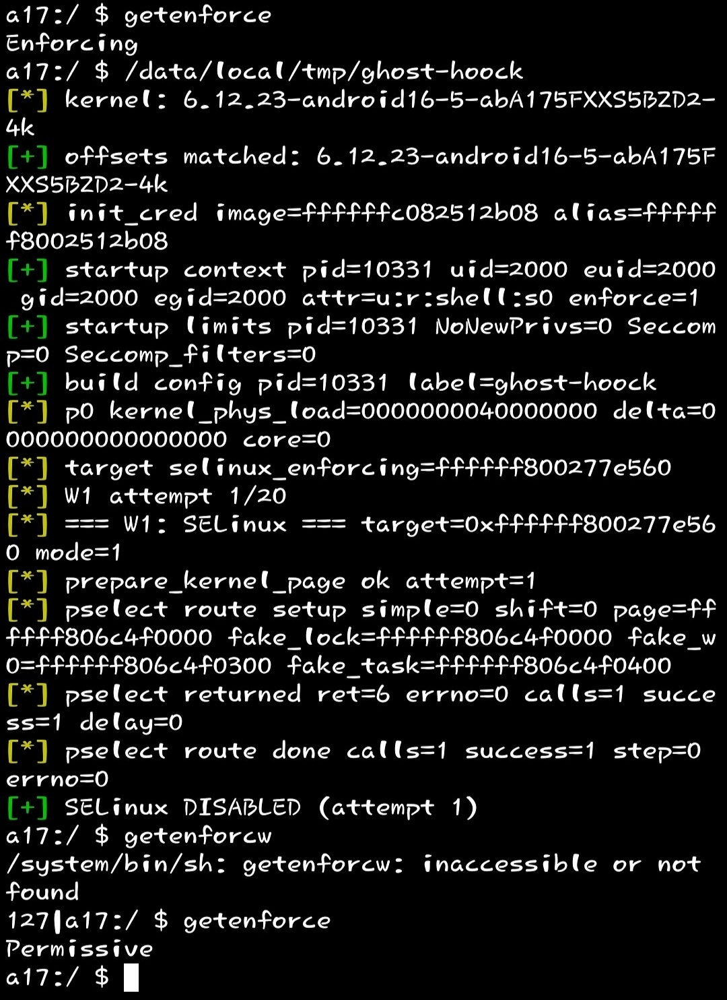

# ghost-hoock

> A minimal fork of [GhostLock](https://github.com/mobilehackinglab/ghostlock-a17) that keeps **only one primitive**: turning off SELinux via CVE-2026-43499 (futex PI UAF).

<p align="center">
  
</p>

<p align="center">
  
  
  
  
  
</p>

---

## Table of contents

- [What is this](#what-is-this)
- [How it works](#how-it-works)
- [What was kept from the original](#what-was-kept-from-the-original)
- [What was removed](#what-was-removed)
- [Building](#building)
- [Running](#running)
- [Requirements](#requirements)
- [Limitations and risks](#limitations-and-risks)
- [Project layout](#project-layout)
- [License](#license)
- [Credits](#credits)
- [Links](#links)

---

## What is this

`ghost-hoock` is a **stripped-down fork** of the [GhostLock](https://github.com/mobilehackinglab/ghostlock-a17) exploit by [Mobile Hacking Lab](https://github.com/mobilehackinglab), reduced to a single primitive:

> **One constrained write via futex PI UAF -> `selinux_enforcing = 0`.**

No root, no `cred` overwrite, no rwforge channel, no UMH, no configfs. Just the minimum needed to flip SELinux into permissive mode on the vulnerable kernel.

Example output on a **Samsung Galaxy A17 (SM-A175F, BZA5)**:

```

[] kernel: 6.12.23-android16-5-abA175FXXS5BZD2-4k
[+] offsets matched: 6.12.23-android16-5-abA175FXXS5BZD2-4k
[] init_cred image=ffffffc082512b08 alias=ffffff8002512b08
[+] startup context pid=10331 uid=2000 euid=2000 gid=2000 egid=2000 attr=u:r:shell:s0 enforce=1
[+] startup limits pid=10331 NoNewPrivs=0 Seccomp=0 Seccomp_filters=0
[+] build config pid=10331 label=ghost-hoock
[] p0 kernel_phys_load=0000000040000000 delta=0000000000000000 core=0
[] target selinux_enforcing=ffffff800277e560
[] W1 attempt 1/20
[] === W1: SELinux === target=0xffffff800277e560 mode=1
[] prepare_kernel_page ok attempt=1
[] pselect route setup simple=0 shift=0 page=ffffff806c4f0000 fake_lock=ffffff806c4f0000 ...
[] pselect returned ret=6 errno=0 calls=1 success=1 delay=0
[] pselect route done calls=1 success=1 step=0 errno=0
[+] SELinux DISABLED (attempt 1)

```

Then:

```bash
$ getenforce
Permissive
```

<p align="center">
  
</p>

---


## How it works

The exploit targets **CVE-2026-43499** — a use-after-free in the Linux kernel's `futex` PI (Priority Inheritance) `rt_mutex` chain. The chain in `ghost-hoock` is four steps:

<details>
<summary><b>1. KernelSnitch mm_struct leak</b></summary>

Timing side-channel against the kernel's futex hash table. We hammer `FUTEX_WAKE_PRIVATE` on a set of user-space futexes, measure `rdtsc` deltas, and correlate hash-bucket collisions. This recovers the address of our own `mm_struct` — the base of the spray page we later need.

This is the [KernelSnitch](https://github.com/IAIK/KernelSnitch) technique, taken verbatim from the original exploit.

</details>

<details>
<summary><b>2. Heap spray</b></summary>

We allocate a large `order-3` slab page, then lay it out with the fake-object layout used by the PI route:

| Offset | Object | Purpose |
|---|---|---|
| `0x0E80` | `fake_lock` | Fake `rt_mutex` |
| `0x0F80` | `fake_fops` | Fake `file_operations` table |
| `0x1180` | `fake_w0` | Fake `rt_mutex_waiter` used as target tree |
| `0x1240` | `fake_right` | Fake rb-tree right node — **this is where the write value comes from** |
| `0x1260` | `fake_left` | Fake rb-tree left node |
| `0x1280` | `fake_task` | Fake `task_struct` |

The whole page is sent through an `AF_UNIX` socket as `SKB_SEND_SIZE = 2 * ORDER3_SIZE` of `sendmsg`, so the skb data lands on our leaked page. Then we free it in a controlled order so that our page ends up on a per-cpu partial slab we can reclaim.

</details>

<details>
<summary><b>3. PI route</b></summary>

Three threads:

- **waiter** — enters `FUTEX_WAIT_REQUEUE_PI` on `f_wait`, targeting `f_pi_target`.
- **owner** — holds `FUTEX_LOCK_PI` on `f_pi_target` and then on `f_pi_chain`.
- **consumer** — spins calling `sched_setattr(tid, SCHED_BATCH, nice=19)` on the waiter's TID, which triggers `rt_mutex_setprio()` and forces the kernel to walk the fake PI tree.

A fourth call from the main thread — `FUTEX_CMP_REQUEUE_PI(1, f_pi_target)` — kicks off the requeue. Inside the kernel, `rb_erase()` runs against our fake tree.

</details>

<details>
<summary><b>4. pselect constrained write</b></summary>

`pselect()` / `select()` copies the user's `fd_set` into kernel stack and later walks it. We arrange the `fd_set` bitmaps so that the words the kernel treats as rb-tree pointers land on `fake_right` and its parent — and the resulting `rb_set_parent(child, parent)` becomes:

```

*(uint64_t *)target = value | color

```

For `mode = 1` (Write 1), `target = selinux_enforcing` and `value = base + 0x100`, which encodes as `byte0 = 0, byte1 = 1`. The kernel writes `0` to `selinux_enforcing[0]` — SELinux is now permissive.

`ret = 6` (instead of the default `9`) confirms the write landed: the consumer hit the target during `select()`, waking it early.

</details>

---

## What was kept from the original

This is a fork of [**mobilehackinglab/ghostlock-a17**](https://github.com/mobilehackinglab/ghostlock-a17) (MIT). The following is taken **1:1** from the upstream exploit:

| Component | File | Notes |
|---|---|---|
| **KernelSnitch** | `src/kernelsnitch/*` | mm_struct leak via futex hash timing |
| **Heap spray** | `src/spray.c` | fake-object layout, `prepare_skb_payload`, `prepare_kernel_page` |
| **PI route + pselect** | `src/route.c` | `prepare_pselect_fdsets`, `do_pselect_fake_lock_route`, `consumer_thread`, `waiter_thread`, `owner_thread` |
| **BZA5 offsets** | `include/offsets_bza5.h` | Symbol table extracted from `6.12.23-android16-5-abA175FXXS5BZD2-4k` |
| **BZA5 target header** | `include/target.h` | Address layout, payload offsets (W1-subset only) |
| **Runtime struct offsets** | `include/runtime_struct_offsets.h` | `_RSO()` macros for `task_struct` fields |

Auxiliary code (`pr_*` macros, `SYSCHK`, `pin_to_core`, `set_limit`, `set_unbuffer`) is also kept as-is from the original.

---

## What was removed

The original GhostLock achieves **full root** on the A17: it installs a rwforge physical R/W channel, patches `cred` / `real_cred`, runs a UMH helper with init creds, captures logs, and more. In `ghost-hoock`, everything past the **first constrained write** is gone.

| Removed file | Why it existed in the original |
|---|---|
| `rwforge_a17.c` | Marching-forger physical R/W channel via pipe_buffers |
| `pipe_physrw.c`, `pipe_reclaim.c` | Pipe-buffer reclaim -> arbitrary kernel read/write |
| `root.c` | `cred` / `real_cred` overwrite, `su` install, SELinux SID patching |
| `umh_root.c`, `wq_umh_root()` (in `main.c`) | Running an init-creds helper from a forged kernel workqueue item |
| `slide.c` | KASLR leak via `boot_id` oracle — **not needed on BZA5, KASLR is off** |
| `miniadb.c` | Bootstrap via ADB TCP |
| `try_cfi_stage()` (in `fops.c`) | CFI-friendly configfs stage used to bootstrap the root path |
| `run_rwforge()`, `run_bootid_oracle()`, `rwforge_root_and_capture()` | The whole root pipeline |
| `install_embedded_su()`, `install_embedded_wallpaper()` | Root-install helpers |
| Write 2 (cred), `patch_cred_*`, `patch_task_seccomp` | Post-W1 credential takeover |

The original GhostLock remains **more complete and powerful** than this fork. `ghost-hoock` is not a replacement — it is a **minimal PoC** for one narrow task: turning SELinux off.

---

## Building

### On-device (clang, Termux or adb shell)

Requires `clang` and `make` in `$PATH`. Tested on Termux; also works via `adb shell` if the toolchain is present.

```bash
git clone https://github.com/genksome/ghost-hoock
cd ghost-hoock
make
```

Output: ./ghost-hoock (aarch64, PIE).

Via Android NDK (on a PC)

```bash
make NDK=/path/to/android-ndk-r26
```

or manually:

```bash
/path/to/ndk/toolchains/llvm/prebuilt/linux-x86_64/bin/aarch64-linux-android21-clang \
    -O2 -Isrc -Isrc/kernelsnitch -Iinclude \
    -D_GNU_SOURCE -D__ARM=1 -DTARGET_CONFIG_H='"target.h"' \
    -fPIE -pie -pthread \
    src/main.c src/spray.c src/route.c -o ghost-hoock
```

Cross-compile check

```bash
file ghost-hoock
# ghost-hoock: ELF 64-bit LSB pie executable, ARM aarch64, ...
```

---


## Running

```bash
# copy the binary somewhere readable from the shell context
cp ghost-hoock /data/local/tmp/
chmod 755 /data/local/tmp/ghost-hoock

# confirm SELinux is currently enforcing
getenforce
# -> Enforcing

# run
/data/local/tmp/ghost-hoock

# verify
getenforce
# -> Permissive
```

Options

```
ghost-hoock [options]
  --attempts N   number of W1 attempts (default: 20)
  --no-drain     skip slab_drain before each W1 attempt
  -h, --help     show help
```

Environment variables

· GHOSTLOCK_CORE — 0..N. CPU core the consumer thread is pinned to. Default: 0.
· KPHYS — 0x.... Kernel physical load address, if it differs from P0_KERNEL_PHYS_LOAD.
· PREPARE_SLABS — 4..64. Number of slab pages prepared during spray. Default: 32.
· PSELECT_SHIFT — -14..14. fd_set word shift. Debug only.
· FOPS_MAX_ATTEMPTS — 4..72. Max prepare_kernel_page attempts for the FOPS payload.
· RWF_DEBUG — any value. Print debug lines from payload construction.

---


## Requirements

- **Device:** Samsung Galaxy A17 SM-A175F (BZA5) — the target this offset table was extracted for.
- **Kernel:** `6.12.23-android16-5-abA175FXXS5BZD2-4k`.
- **Context:** must be run from the `shell` SELinux context (`u:r:shell:s0`), not from an app.
- **Permissions:** nothing special — no root required. The whole point is to disable SELinux *without* root.

> **Porting:** other devices/kernels need their own offset table. Add a new `OFFSETS_ENTRY(...)` in `include/offsets_bza5.h` with symbol offsets extracted from `vmlinux`/`kallsyms` for that build, then rebuild.

---

## Limitations and risks

- **Kernel panics are possible.** The fork inherits the original's risk: a wrong `page_base` or a write that lands on unrelated memory will crash the kernel. The fork has *less* surface than the original (no rwforge, no cred patch, no UMH), so it is statistically safer, but not 100% bulletproof.
- **KASLR is off on BZA5.** The exploit relies on `slide = 0`. There is **no KASLR-leak** in this fork. If you port it to a KASLR-enabled kernel, you must bring back `slide.c` from the original.
- **SELinux only.** The fork does not give root. It only writes `0` to `selinux_enforcing`. If you need root, use the full [ghostlock-a17](https://github.com/mobilehackinglab/ghostlock-a17).
- **Single write.** Only Write 1 (`selinux_enforcing = 0`) is retained. Do not try to extend it into Write 2 or the rwforge pipeline without understanding the PI route deeply.
- **Requires the write to land within ~20 attempts.** If the first W1 attempt misses, the loop retries. On a fresh boot with a mostly-idle system, it typically lands on attempt 1.

---

## Project layout

```

ghost-hoock/
├── include/
│   ├── ghost_hoock.h              # shared header, API
│   ├── offset.h                   # TARGET_CONFIG_H dispatcher
│   ├── offsets_bza5.h             # symbol offsets (BZA5 only)
│   ├── runtime_struct_offsets.h   # dynamic struct offsets (_RSO macros)
│   └── target.h                   # BZA5 addresses, payload layout
├── src/
│   ├── main.c                     # CLI, offset selection, W1 loop
│   ├── spray.c                    # KernelSnitch + heap spray + ashmem
│   ├── route.c                    # PI route + pselect constrained write
│   └── kernelsnitch/              # mm_struct leak (from upstream)
│       ├── kernelsnitch.h
│       ├── futex_hash.h
│       ├── timeutils.h
│       └── utils.h
├── docs/
│   └── img/
│       └── screenshot.jpg
├── Makefile
├── LICENSE
├── .gitignore
└── README.md

```

---

## License

**MIT** — same as the upstream [ghostlock-a17](https://github.com/mobilehackinglab/ghostlock-a17). See `LICENSE`.

This fork retains the original copyright notice from `mobilehackinglab` (2026) and adds the fork authors on top, as required by the MIT terms.

The project is published strictly for **security research on your own device**. Running it against a device you do not own is illegal in most jurisdictions.

---

## Credits

- [**Mobile Hacking Lab**](https://github.com/mobilehackinglab) — original [ghostlock-a17](https://github.com/mobilehackinglab/ghostlock-a17) exploit, on which this fork is built.
- [**IAIK KernelSnitch**](https://github.com/IAIK/KernelSnitch) — `mm_struct` leak technique.
- Original CVE-2026-43499 researchers — for reverse-engineering the futex PI UAF.

---

## Links

- Upstream exploit: https://github.com/mobilehackinglab/ghostlock-a17
- This fork: https://github.com/genksome/ghost-hoock
- CVE: **CVE-2026-43499**

---

<p align="center">
  <sub>Built for research. Tested on a single physical device. Use at your own risk.</sub>
</p>
